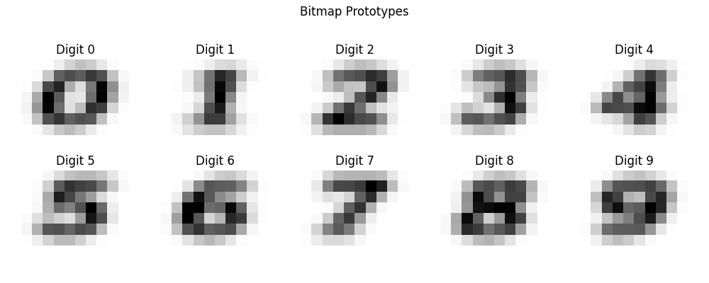
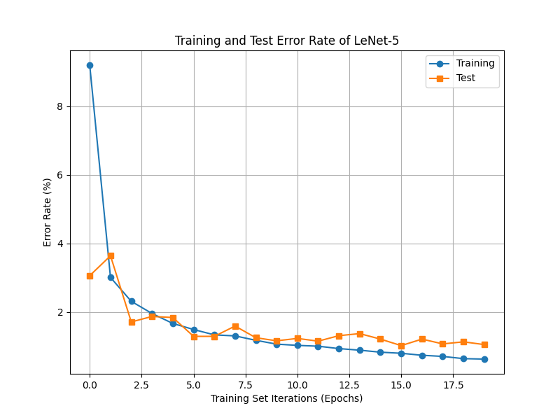
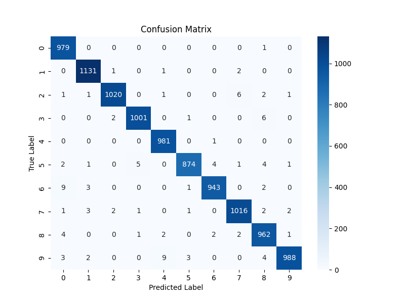
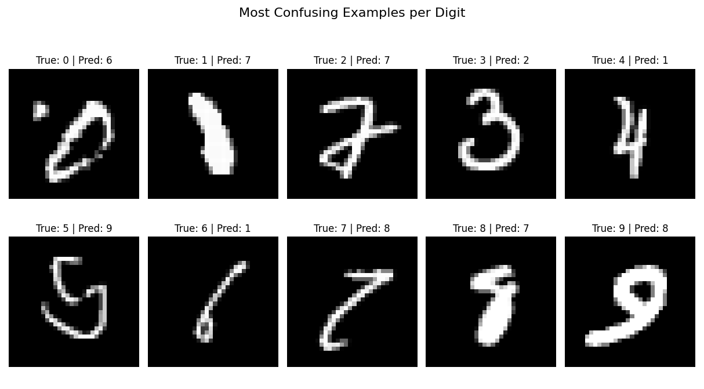
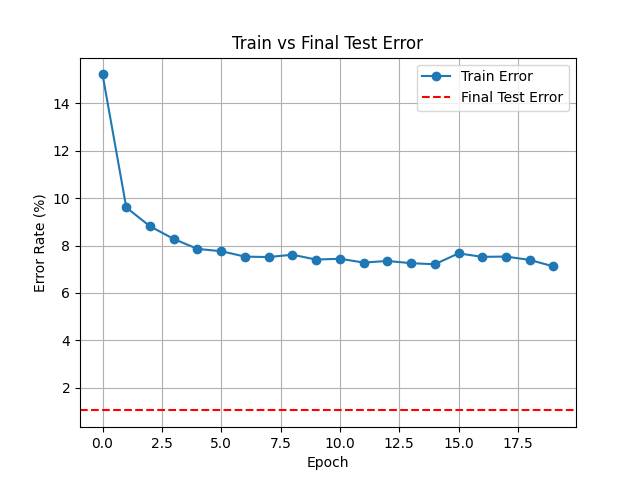
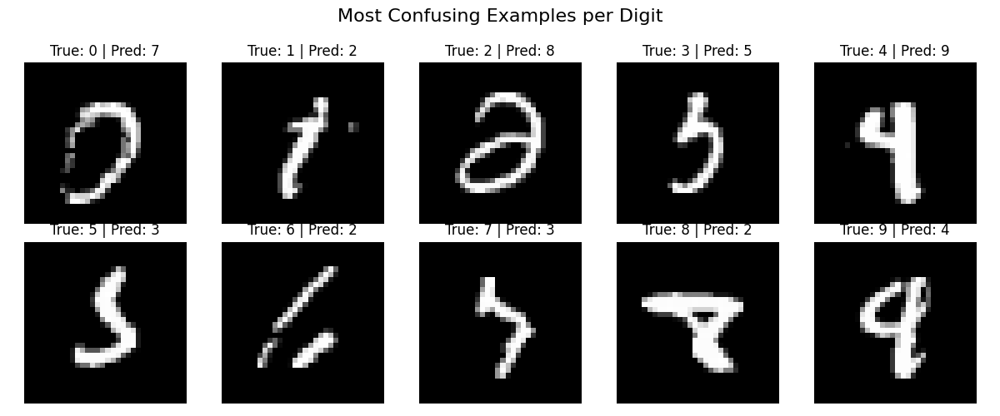

# LeNet 5 Project

## Original LeNet 5 Model Implementation  
Source: "Gradient-Based Learning Applied to Document Recognition" by Yann LeCun, Leon Bottou, Yoshua Bengio, and Patrick Haffner

### Architecture: RBF Parameters from DIGIT
For the RBF parameters, we used the DIGIT dataset. Each digit (0–9) had several small 7×12 grayscale images. To generate the RBF prototypes, we loaded the image tensors from each digit’s directory, resized them to 7×12, and averaged all images for a given digit to create a representative prototype. This averaging approach reduces noise and yields a smooth, centralized prototype for each class, improving the robustness of the RBF classifier. These 84-dimensional flattened prototypes serve as the reference centers for the squared Euclidean distance computation in the RBF output layer.  

  
Figure 1: Generated 7×12 bitmap prototypes for digits 0–9. Each image represents the average
shape of a digit from the DIGIT dataset.    

### Training
Data: MNIST dataset from torchvision.datasets, resized from 28x28 to 32x32 using padding.  
Batch size: 1  
Loss function: Margin loss using equation (9) from the paper listed in the header.  
Gradient descent: SGD optimizer with learning rate = 0.01 and momentum = 0.9  
Tracking: Train and test error tracked at every epoch.  
Epochs: 20    

  
Figure 2: Training and Test Error Across Epochs (Original MNIST)    

### Performance Evaluation
• Confusion matrix (10×10) for test set at epoch 20.  
• Most confusing digits identified based on max incorrect predictions.  
• Final error rates at epoch 20:  
– Train error: 0.63 %  
– Test error: 1.05 %  

  
Figure 3: Confusion Matrix on Original MNIST Test Set    
  
Figure 4: Most Confusing Examples per Digit (True Label vs. Predicted Label)    

## LeNet Modification for Unseen Data
### Modification Description
We implemented several modifications to enhance generalization on transformed and unseen data:  
(a) Max Pooling: Replaced average pooling layers with max pooling. Max pooling captures stronger feature activations and is more resilient to spatial noise.  
(b) ReLU Activation: Replaced Tanh with ReLU to reduce vanishing gradient risk and enhance sparsity.  
(c) Data Normalization: Normalized pixel values to [0, 1].  
(d) Dropout: Added dropout layers to prevent overfitting on training data.    
### Performance on Unseen Data
As shown in the error rate graph, LeNet2 achieved rapid initial convergence, with training error decreasing from 21% to below 8% within the first few epochs. However, the test error remained consistently low and stable, around 1.1%, indicating strong generalization performance. Unlike the first model, LeNet2 avoided overfitting, likely due to the inclusion of dropout layers and a more resilient activation/pooling strategy. The final test error was 1.1%, corresponding to a test accuracy of 98.9% on the transformed MNIST dataset.  
  
Figure 5: Training and Test Error (LeNet2)    
  
Figure 6: Confusion Matrix for Modified LeNet on Transformed MNIST Data    
  
Figure 7: Most Confusing Examples per Digit for Modified Model (True Label vs. Predicted Label)
